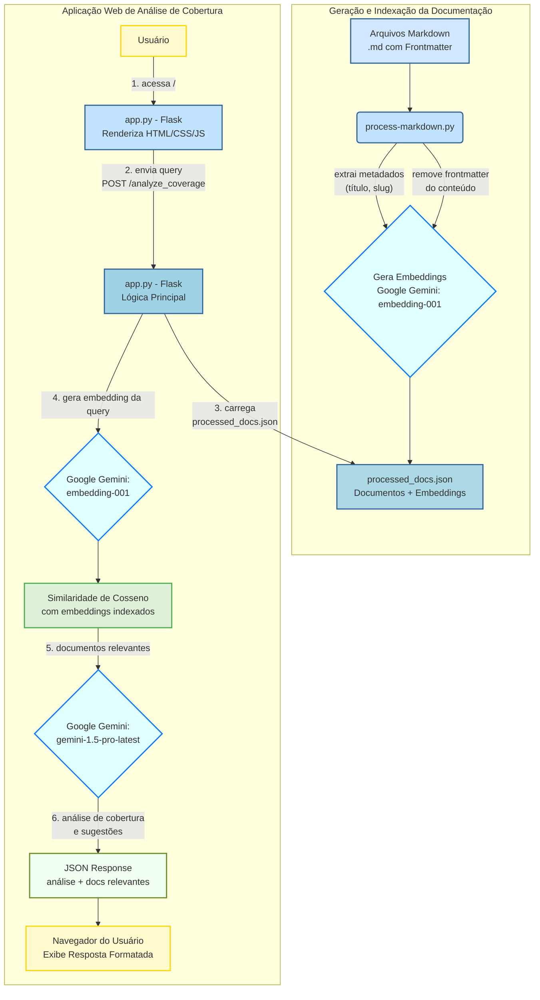

## Análise de cobertura da documentação com gemini e flask

Este projeto apresenta uma aplicação web simples, desenvolvida com Flask e Google Gemini, para analisar a cobertura de uma base de documentação existente. Ele permite que o usuário insira um tópico ou pergunta e receba sugestões de melhoria ou expansão para a documentação, indicando também os documentos relevantes utilizados na análise.

## Visão geral do projeto

A aplicação é composta por três scripts principais, trabalhando em um pipeline:

* `extract_data_from_markdown.py`: responsável por processar o arquivo markdown consolidado, extrair metadados como título e slug, e o conteúdo limpo de cada documento. Ele salva esses dados em um arquivo JSON intermediário (`raw_docs.json`).
* `generate_embeddings.py`: este script lê o `raw_docs.json` gerado pela etapa anterior e interage com o Google Gemini para gerar embeddings de texto para cada documento. Ele salva o resultado final, incluindo os embeddings, em `processed_docs.json`.
* `app.py`: a aplicação web Flask em si. Ela carrega a documentação indexada do `processed_docs.json`, aceita requisições de análise de cobertura, encontra documentos relevantes usando a similaridade de embeddings, e utiliza o modelo `gemini-1.5-pro-latest` (ou `gemini-pro`) para gerar a análise e sugestões de melhoria.

## Principais conceitos

Para entender o funcionamento deste projeto, é importante familiarizar-se com alguns conceitos-chave:

* **Embeddings de texto**: são representações numéricas de texto em um espaço vetorial de alta dimensão. Textos com significados semelhantes são mapeados para pontos próximos nesse espaço. O modelo `embedding-001` do Google Gemini é utilizado para gerar esses vetores.
* **Similaridade de cosseno**: é uma métrica usada para medir a similaridade entre dois vetores não nulos em um espaço vetorial. No contexto deste projeto, é utilizada para encontrar documentos cujos embeddings (vetores) são "próximos" ao embedding da pergunta do usuário, indicando relevância contextual.
* **Processamento de linguagem natural (PLN)**: é um campo da inteligência artificial que foca na interação entre computadores e linguagem humana. Os modelos Gemini são exemplos de modelos de PLN avançados, capazes de entender, gerar e interagir com texto.
* **Modelos generativos (LLMs)**: são uma classe de modelos de inteligência artificial, como o Gemini 1.5 Pro (ou Gemini Pro), capazes de gerar texto coerente e relevante com base em um prompt de entrada. Neste projeto, eles são usados para analisar o contexto dos documentos e sugerir melhorias na documentação.
* **Frontmatter**: um bloco de metadados localizado no início de um arquivo Markdown, geralmente delimitado por marcadores específicos. Neste projeto, ele é usado para definir metadados como `title` (título do documento) e `slug` (um identificador único amigável para URLs), que são extraídos e utilizados na indexação e exibição.

## Como configurar e executar

Siga os passos abaixo para colocar o projeto em funcionamento:

### Pré-requisitos

* Python 3.8+
* Uma chave de API do Google Gemini (configurada na variável de ambiente `GOOGLE_API_KEY`).

### 1. Clone o repositório

```bash
git clone <url_do_seu_repositório>
cd <nome_do_seu_repositório>
```

### 2. Configure o ambiente

Crie um arquivo `.env` na raiz do projeto e adicione sua chave de API do Google:

```
GOOGLE_API_KEY="SUA_CHAVE_API_AQUI"
```

### 3. Instale as dependências

```bash
pip install -r requirements.txt
# Se você não tiver um requirements.txt, use:
# pip install Flask google-generativeai numpy python-dotenv scipy
```

### 4. Prepare sua documentação

Certifique-se de que seus arquivos Markdown estão consolidados em um único arquivo, por exemplo, `senhasegura_docs_consolidated.md`. O formato esperado para cada documento consolidado é:

```markdown
## Arquivo: caminho/para/seu/arquivo.md
---
## Metadata_Start
## code: en
## title: Nome do seu Título do Documento
## slug: seu-slug-unico-aqui
## seoTitle: SEO Title opcional
## description: Descrição opcional
## contentType: Markdown
## Metadata_End
Conteúdo real do seu documento Markdown começa aqui...
```

### 5. Extraia os dados da documentação

Execute o script de extração para criar o arquivo `raw_docs.json` com os dados brutos:

```bash
python extract_data_from_markdown.py
```

Este script lerá `senhasegura_docs_consolidated.md` e extrairá o título, o slug e o conteúdo limpo de cada documento, salvando-os em `raw_docs.json`.

### 6. Gere os embeddings

Execute o script de geração de embeddings para criar o arquivo `processed_docs.json`:

```bash
python generate_embeddings.py
```

Este script lerá `raw_docs.json`, gerará os embeddings para cada documento usando o Google Gemini e salvará o resultado em `processed_docs.json`.

### 7. Execute a aplicação flask

```bash
python app.py
```

A aplicação será iniciada e estará disponível em `http://127.0.0.1:5000/` (ou outra porta, dependendo da sua configuração).

## Uso

1.  Abra seu navegador e acesse `http://127.0.0.1:5000/`.
2.  No formulário, digite o tópico ou pergunta sobre o qual você deseja analisar a cobertura da documentação (ex: "funcionalidades de JIT", "integração com Azure AD").
3.  Clique em "Analisar Cobertura".
4.  A aplicação retornará sugestões de melhoria para a documentação e listará os documentos relevantes utilizados na análise, mostrando o título, o slug e o grau de relevância de cada um.

## Estrutura de arquivos

```
.
├── app.py
├── extract_data_from_markdown.py
├── generate_embeddings.py
├── senhasegura_docs_consolidated.md  (seu arquivo de documentação consolidado)
├── raw_docs.json                   (gerado por extract_data_from_markdown.py)
├── processed_docs.json             (gerado por generate_embeddings.py)
├── .env                            (com sua GOOGLE_API_KEY)
└── README.md
```

## Diagrama de fluxo



## Contribuição

Contribuições são bem-vindas! Sinta-se à vontade para abrir issues ou pull requests para melhorias.